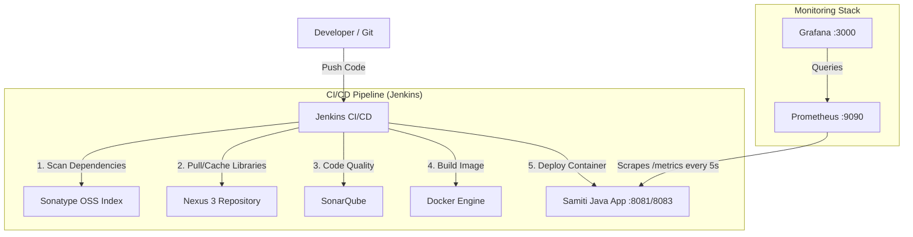

# Complete Enterprise DevOps & Monitoring Pipeline

This document serves as your permanent reference guide for the entire CI/CD and Monitoring infrastructure we built. You can use this to rebuild the system from scratch, understand every moving part, and debug future issues.

## 1. System Architecture



---

## 2. Launching the Infrastructure (Manual Startup)

If you ever move to a new computer or wipe your Docker Desktop, run these commands to spin up your entire infrastructure.

> [!IMPORTANT] 
> Because you are on Windows, we use `host.docker.internal` inside the containers so they can talk to each other (e.g., Jenkins talking to SonarQube, Prometheus talking to the Java App).

### A. Jenkins (CI/CD Server)
```bash
docker run -d --name jenkins -p 8080:8080 -p 50000:50000 -v jenkins_home:/var/jenkins_home jenkins/jenkins:latest
```

### B. Sonatype Nexus 3 (Artifact Repository)
```bash
docker run -d --name nexus -p 8082:8081 sonatype/nexus3
```

### C. SonarQube (Code Quality & Security)
```bash
docker run -d --name sonarqube -p 9000:9000 sonarqube:lts-community
```

### D. Prometheus (Metrics Database)
```bash
docker run -d --name prometheus -p 9090:9090 -v C:\Users\siddi\OneDrive\Documents\siddiqiaadil786\project1\prometheus.yml:/etc/prometheus/prometheus.yml prom/prometheus
```

### E. Grafana (Visualization Dashboard)
```bash
docker run -d --name grafana -p 3000:3000 grafana/grafana:latest
```

---

## 3. Integration Guide: Where to add details

When setting this up from scratch, here is exactly where the URLs, Passwords, and Tokens need to be mapped between the tools:

### A. Maven <-> Nexus Integration
* **File:** `settings.xml` (located in your root project folder).
* **Where to add details:** 
  * Add the Nexus Username and Password under `<server>` -> `<id>nexus-public</id>` -> `<username>` and `<password>`.
  * Add the Nexus Container URL under `<mirror>` -> `<url>http://host.docker.internal:8082/repository/maven-public/</url>`.

### B. Jenkins <-> SonarQube Integration
* **File:** `Jenkinsfile` (located in your root project folder).
* **Where to add details:** 
  * Under the `SonarQube Analysis` stage, replace the value of `SONAR_TOKEN = 'your_token_here'`.
  * The command requires `-Dsonar.host.url=http://host.docker.internal:9000` to point to the Sonar container.

### C. Prometheus <-> Java App Integration
* **File:** `prometheus.yml`
* **Where to add details:** 
  * Under `scrape_configs` -> `static_configs` -> `targets: ['host.docker.internal:8083']`. This tells Prometheus exactly which port your Java app is emitting metrics from.

---

## 4. How to create the Grafana Dashboard Manually

If you ever need to set up Grafana manually from scratch without an API script, follow these exact steps:

### Step 1: Connect Prometheus (The Data Source)
1. Open Grafana (`http://localhost:3000`) and login.
2. On the left menu, click **Connections** -> **Add new connection**.
3. Search for **Prometheus** and click **Add new data source**.
4. In the **URL** box, type exactly: `http://host.docker.internal:9090`
5. Scroll to the bottom and click **Save & Test**. (You should see a green success message).

### Step 2: Build the Charts (The Dashboard)
1. Click the **+** (Plus) icon in the top right menu and select **New Dashboard**.
2. Click **+ Add visualization**.
3. Select the **Prometheus** data source you just created.
4. In the "Metrics" or "Query" field at the bottom, type one of these exact queries:
   * For Memory: `jvm_memory_bytes_used`
   * For CPU: `process_cpu_seconds_total`
   * For Active Users/Threads: `jvm_threads_current`
5. Click the blue **Run queries** button in the top right of the query box. 
6. On the right-side panel, rename the Title to "JVM Memory Used" and click **Apply** in the top right corner.
7. Repeat this process for CPU and Threads to build the full dashboard. Finally, click the **Save** icon at the top of the dashboard.

---

## 5. Changing Passwords & API Tokens

If you ever need to change a password or if a token expires, here is how to reset them and where to update your code:

### Nexus 3
* **How to change:** Log into Nexus (`localhost:8082`), click your username "admin" in the top right corner, click **Account**, and select **Change Password**.
* **Where to update:** After changing it, open your `settings.xml` file and update the `<password>` tag.

### SonarQube
* **How to change Password:** Log into SonarQube (`localhost:9000`), click the User icon top right -> **My Account** -> **Security** -> **Change Password**.
* **How to generate a new Token:** In that same Security tab, go to "Generate Tokens", type a name (e.g., "Jenkins"), select "Global Analysis Token", and click Generate.
* **Where to update:** Open your `Jenkinsfile` and replace the `SONAR_TOKEN` variable with the newly generated string.

### Grafana
* **How to change:** Log into Grafana (`localhost:3000`), click your avatar in the bottom left corner, click **Profile**, and select **Change Password**. 
* **Where to update:** You do not need to update any code files for Grafana. It only reads data, so no external systems need its password.

### Jenkins
* **How to change:** Log into Jenkins (`localhost:8080`), go to **Dashboard** -> **Manage Jenkins** -> **Security** -> **Users**. Click the gear icon next to your admin account and scroll down to the Password section.

---

## 6. Commands to Verify Health Manually

If things break in the future, run these commands in PowerShell to diagnose the issue:

**1. Check if all containers are alive:**
```powershell
docker ps
```

**2. Check if the Java App is actively emitting metrics:**
```powershell
Invoke-WebRequest -Uri http://localhost:8083/metrics -UseBasicParsing
```

**3. Check if Prometheus is successfully scraping the Java App:**
```powershell
curl.exe -s http://localhost:9090/api/v1/targets
```
*(Look for `"health":"up"`)*.
